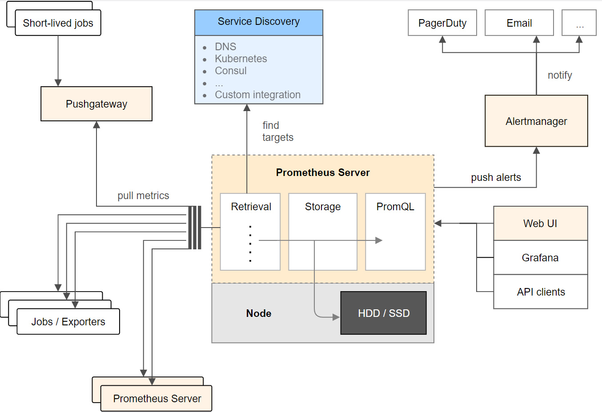

# 现在我们做监控一般是这样的：

## 先搭个监控服务端
## 各被监控客户端往服务端push数据(或服务端定时主动去客户端pull，我们现在就是这种模式)
## 服务端把pull的数据存到时序数据库中
## 再搭建一个图形面板Grafana展示收集的监控数据

**promethueus是很好的监控服务端**

Exporter：负责收集目标对象（如Host或Container）的性能数据，并通过HTTP接口供Prometheus Server获取。每一个客户端都会提供一个 /metrics 的get接口
Prometheus Server：负责从客户端(Exporters)拉取和存储监控数据，并给用户通过PromQL查询。
可视化组件 Grafana：获取Prometheus Server提供的监控数据并通过Web UI的方式展现数据的仪表盘。
AlertManager：负责根据告警规则和预定义的告警方式发出例如Email、Webhook之类的告警。